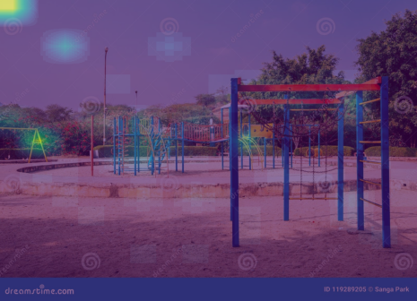

# Vision Transformers for Scene Recognition

Fine-tuning and benchmarking modern image-classification backbones — **Vision
Transformer (ViT)**, **DINOv2**, **Swin**, **ConvNeXt** and a **ResNet-50**
CNN baseline — on a 40-class subset of the [Places2](http://places2.csail.mit.edu/)
scene-recognition dataset.

The project is built around a single, config-driven training pipeline: every
experiment (model, optimiser, scheduler, augmentation policy) is described by a
small YAML file, so results are reproducible and new backbones can be added
without touching the training code.

> University coursework / portfolio project. The same code runs on an NVIDIA
> GPU (CUDA + automatic mixed precision), on Apple Silicon (MPS) and on CPU —
> the device is selected automatically.

---

## Highlights

- **One pipeline, many backbones.** Switch between ViT, DINOv2, Swin, ConvNeXt
  or DeiT by changing a single line in a config file — all loaded through
  Hugging Face's `AutoModelForImageClassification`. ResNet-50 is kept as a
  classic CNN baseline.
- **Reproducible experiments.** Each run is fully specified by a YAML config
  and seeded; the resolved config is saved alongside every checkpoint.
- **Rich logging.** TensorBoard scalars, a per-epoch `metrics.csv`, a
  confusion matrix and the best checkpoint are written to a timestamped run
  directory.
- **Explainability.** Attention-map overlays for the transformer models and
  top-k prediction galleries help interpret *what the model looks at*.
- **Solid engineering.** Automatic device selection (CUDA → MPS → CPU),
  mixed-precision training on GPU, early stopping, top-k accuracy and a
  cleanup utility for corrupt images.

---

## Models

| Key (`model_name`)                        | Family            | Notes                              |
| ----------------------------------------- | ----------------- | ---------------------------------- |
| `google/vit-base-patch16-224`             | Vision Transformer| Main supervised ViT baseline       |
| `facebook/dinov2-base`                    | DINOv2            | Self-supervised pre-training       |
| `microsoft/swin-tiny-patch4-window7-224`  | Swin Transformer  | Hierarchical / shifted windows     |
| `facebook/convnext-tiny-224`              | ConvNeXt          | Modern CNN, transformer-competitive|
| `resnet50`                                | ResNet (CNN)      | Classic convolutional baseline     |

Any other Hugging Face image-classification checkpoint works too — just set
`model_name` in a config.

---

## Experiments

The dataset is a 40-class Places2 subset (1,000 images per class, 40,000
total) with an 80/20 train/validation split (seed `42`). The `configs/`
directory captures the study performed:

- **Backbone comparison** — ViT vs. DINOv2 vs. Swin vs. ConvNeXt vs. ResNet-50.
- **Hyper-parameter sweeps** — learning rate (`lr_low_config`, `best_config`),
  batch size (`batch48`, `b64`), scheduler (`cosine` vs. `steplr`) and
  augmentation strength (`dataaug`, `highaug`).

Among the backbones evaluated, the self-supervised **DINOv2** features gave the
strongest scene-recognition performance, ahead of the supervised ViT and the
CNN baselines.

Every run is self-contained and reproducible: the resolved config, the best
checkpoint, a 40×40 confusion matrix and TensorBoard logs are written to a
timestamped directory under `results/runs/`.

### Attention visualisations

Last-layer self-attention from the `[CLS]` token, overlaid on the input —
the transformers concentrate on the discriminative parts of each scene.

| ViT — airport | ViT — bridge | DINOv2 — playground |
| :---: | :---: | :---: |
|  |  |  |

---

## Project structure

```
ViT_for_scene_recognition/
├── configs/                 # one YAML per experiment
│   ├── base_config.yaml         # ViT baseline
│   ├── best_config.yaml         # best ViT hyper-parameters
│   ├── dino_config.yaml         # DINOv2
│   ├── swin_config.yaml         # Swin Transformer
│   ├── convnext_config.yaml     # ConvNeXt
│   ├── resnet_config.yaml       # ResNet-50 baseline
│   ├── m1_demo.yaml             # short laptop-friendly demo run
│   └── ...                      # LR / batch-size / augmentation studies
├── scripts/
│   ├── train_from_config.py     # config-driven training + evaluation
│   ├── evaluate.py              # evaluate a checkpoint on a custom test set
│   ├── visualize_attention.py   # attention-map overlays
│   ├── visualize_predictions.py # top-k prediction galleries
│   └── clean_dataset.py         # delete corrupt/unreadable images
├── utils/
│   ├── dataset.py               # PlacesDataset (image-folder loader)
│   ├── device.py                # CUDA → MPS → CPU selection
│   └── models.py                # unified model + normalisation helpers
├── results/                 # sample attention maps (run outputs are git-ignored)
├── requirements.txt
└── README.md
```

---

## Dataset

Expected layout — one folder per class under `data/Places2_simp/`:

```
data/Places2_simp/
├── airport_terminal/
│   ├── 00000001.jpg
│   └── ...
├── amphitheatre/
└── ...                     # 40 classes total
```

The `data/` directory is git-ignored. Before training, you can drop corrupt
files with:

```bash
python scripts/clean_dataset.py --dir data/Places2_simp
```

---

## Usage

Dependencies are listed in `requirements.txt`. On a Linux machine with an
NVIDIA GPU, training automatically uses CUDA with fp16 automatic mixed
precision (set `precision: "fp16"` in the config); on Apple Silicon / CPU the
code falls back to fp32 with no changes required.

### 1. Training

```bash
# DINOv2
python scripts/train_from_config.py --config configs/dino_config.yaml

# ViT (best hyper-parameters)
python scripts/train_from_config.py --config configs/best_config.yaml

# ResNet-50 baseline
python scripts/train_from_config.py --config configs/resnet_config.yaml

# Quick smoke / demo run (a few minutes)
python scripts/train_from_config.py --config configs/m1_demo.yaml
```

### 2. Evaluate on a custom test set

```bash
python scripts/evaluate.py \
    --model_path results/runs/<run>/vit_best.pth \
    --test_dir data/custom_test_set/ \
    --model_name google/vit-base-patch16-224
```

### 3. Visualise predictions and attention

```bash
# Top-k prediction gallery (use --correct or --incorrect)
python scripts/visualize_predictions.py \
    --model_path results/runs/<run>/vit_best.pth \
    --model_name google/vit-base-patch16-224 \
    --correct --save_path results/predictions.png

# Attention overlay for a single image
python scripts/visualize_attention.py \
    --model_path results/runs/<run>/vit_best.pth \
    --model_name google/vit-base-patch16-224 \
    --image_path path/to/image.jpg \
    --save_path results/attention.png
```

### 4. Compare runs in TensorBoard

```bash
tensorboard --logdir results/runs/
```

---

## Configuration reference

Each YAML config understands the following keys:

| Key             | Description                                                        |
| --------------- | ------------------------------------------------------------------ |
| `run_name`      | Human-readable name; timestamped per run                           |
| `data_dir`      | Path to the image-folder dataset                                   |
| `model_name`    | Backbone (see [Models](#models))                                   |
| `precision`     | `fp16` (CUDA mixed precision) or `fp32`                            |
| `epochs`        | Maximum number of epochs                                           |
| `batch_size`    | Mini-batch size                                                    |
| `num_workers`   | DataLoader workers (default 4)                                     |
| `max_per_class` | Optional cap on images per class for quick runs                   |
| `optimizer`     | `AdamW` or `SGD` with `lr`, `weight_decay`/`momentum`            |
| `scheduler`     | `cosine`, `step` (`step_size`, `lr_gamma`), or omit for none      |
| `augmentations` | List of torchvision transforms with parameters                    |
| `seed`          | Random seed for the train/val split                               |
| `patience`      | Early-stopping patience (epochs without val improvement)          |

---

## Acknowledgements

- [Places2](http://places2.csail.mit.edu/) scene-recognition dataset.
- Pre-trained backbones from [Hugging Face Transformers](https://github.com/huggingface/transformers)
  and [torchvision](https://github.com/pytorch/vision).

## License

Released under the [MIT License](LICENSE).
